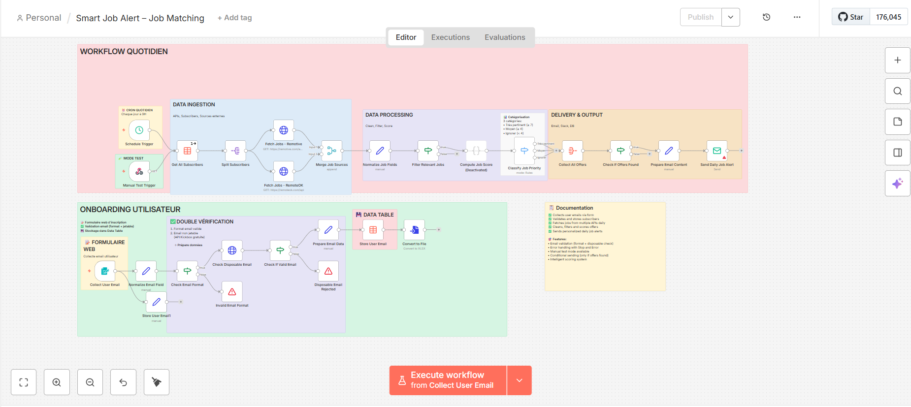

# 🎯 Smart Job Alert — My First n8n Automation Workflow

**The Story:** I was tired of manually scrolling through job boards and missing relevant opportunities. So I decided to build my first n8n workflow to automate job matching. This is me applying what I learned from DataCamp into something real and useful.

Built by **Farah Rihane** 👩‍💻 — Software Engineer learning automation, one workflow at a time.

---

## 🎯 What Does It Do?

**Smart Job Alert** checks job boards automatically every morning and sends me personalized job matches. No more manual scrolling!

**How It Works:**
- Fetches fresh job listings from APIs (Remotive, GitHub Jobs, etc.)
- Filters by my keywords (automation, JavaScript, API stuff)
- Scores jobs based on relevance
- Validates email format to avoid spam
- Sends me a daily email with top matches

**What I Used:** n8n (automation platform), REST APIs, JavaScript, and SMTP (for emails)

---

## ✨ Features

- **Email validation** — Makes sure emails are real (no spam traps)
- **Smart filtering** — Only shows jobs with keywords I care about
- **Scoring system** — Ranks jobs by relevance to my skills
- **Daily alerts** — Sends results every morning via email
- **Multiple sources** — Pulls from Remotive, GitHub Jobs, and more

---

## 🏗️ How I Built This

**The simple flow:**
1. **Every morning** → n8n checks job APIs
2. **Filter** → Keep only jobs with relevant keywords
3. **Score** → Rank by how relevant they are to me
4. **Validate** → Make sure the email address is real
5. **Send** → Email me the best matches

That's it! No databases, no machine learning, just simple rules that work.

(See `screenshots/Workflow1.png` for the visual flow in n8n)

---

## 📁 Folder Structure

* `Smart Job Alert – Job Matching.json`: n8n workflow export
* `screenshots/`: Workflow and interface screenshots
* `assets/`: Documentation, diagrams, sample data



---

## 🎓 What I Learned Building This

- How to use REST APIs in n8n workflows
- JSON data transformation and cleaning  
- Conditional logic (if/then) in automation
- Email validation and sending
- Cron scheduling for automation

Every feature in this workflow taught me something new. If you build this, you'll learn the same!

---

## 🚀 Get Started (It's Easy!)

### All You Need
- n8n account (free: https://n8n.io)  
- Optional: Gmail SMTP setup for emails

### The Steps

**1. Import the workflow**
- Download `Smart Job Alert – Job Matching.json`
- Open n8n → Create workflow → Menu (⋮) → Import
- Select the JSON file → Done!

**2. Customize your keywords**
- Click the **Code** node in the workflow
- Change keywords to match YOUR skills (automation, JavaScript, whatever you want)
- Save

**3. Turn it on**
- Toggle **Active** at the top
- Click **Execute workflow** to test
- Check your email!

---

## ⚙️ Want to Customize It?

### Change when it runs
In the **Cron trigger** node:
- `0 09 * * *` = Daily at 9 AM
- `0 09 * * 1-5` = Weekdays only  
- `0 */4 * * *` = Every 4 hours

### Add different job boards
Just add another **HTTP Request** node pointing to:
- Remotive: `https://remotive.com/api/remote-jobs`
- GitHub Jobs: `https://jobs.github.com/positions.json`
- Justjoin.it: `https://justjoin.it/api/offers`

Merge the results and you're done!

### Fine-tune the scoring
Edit the **Code** node to boost/penalize certain keywords:

```javascript
if (text.includes("senior")) score += 5; // Boost for senior
if (text.includes("remote")) score += 1; // Prefer remote  
if (text.includes("contract")) score -= 2; // Lower for contract
```

---

## 📁 What You'll Find Here

- `Smart Job Alert – Job Matching.json` — The complete workflow (ready to import!)
- `screenshots/` — Visual walkthrough of the workflow
- `assets/` — Additional documentation and images

---

## 🐛 Troubleshooting

If something goes wrong, here's what usually helps:

| Problem | Solution |
|---------|----------|
| No jobs returned | Check that the API URL is correct and keywords match |
| Email not sending | Verify SMTP credentials; Gmail needs app passwords |
| Workflow not triggering | Check that **Active** toggle is ON and schedule is correct |
| API returns errors | Wait a moment and try again; some APIs have rate limits |

---

## 🤝 Want to Build Something Like This?

I'm sharing this because I believe in learning in public. If you want to:
- **Get inspired** → Check out the workflow file and screenshots
- **Ask questions** → Feel free to open an issue (I'm learning too!)
- **Build your own** → Follow the setup guide below — it's easier than you think

**Ideas if you want to extend this:**
- Add more job board APIs
- Filter by location or salary
- Save results to a database
- Build a simple dashboard to view jobs
- Improve the scoring algorithm

---

## 📈 The Results

- **Speed:** ~2-5 seconds per run
- **Frequency:** Once per day
- **Jobs processed:** 50-500 per run  
- **Cost:** Free!
- **Uptime:** Handled by n8n 😎

---

## 💡 Why I'm Sharing This

When I started learning automation, I felt lost. I saw tutorials showing "enterprise-grade" workflows that felt impossible to build. So I'm sharing THIS — my actual first project. It's simple, it works, and it taught me real skills.

**My motivation:** Prove that you don't need to be an expert to start building. You just need to start.

If this helps you build something cool, that makes my day. Let me know what you're building! 🚀

---

**Made with ❤️ by Farah**  
*Automating life, one workflow at a time*
